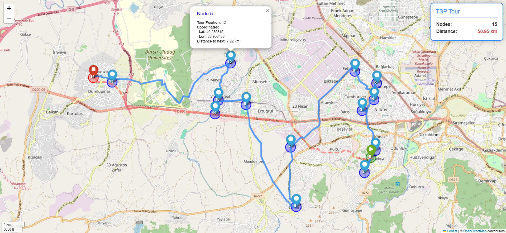

# Assignment 2: Real Map TSP using OSM Data

> Nearest Neighbor algorithm applied on real-world OpenStreetMap (OSM) data with Folium visualization

---

## Overview

This task extends the basic TSP implementation to **real maps** using **OpenStreetMap** data via the `osmnx` library.  
Instead of randomly generated points, this version samples real road network nodes from a given city or region.

The solution uses the **Nearest Neighbor heuristic** directly on the OSM graph, computing shortest paths between nodes using `networkx.shortest_path_length`.

### Key Features

- **Real map integration** – Uses OSM data for realistic road networks  
- **Connected component filtering** – Ensures only the largest connected road area is used  
- **Greedy TSP solver** – Nearest Neighbor heuristic applied to true driving distances  
- **Interactive map output** – Folium-based HTML map visualization with route statistics and pop-ups

---

## Algorithm Details

### Nearest Neighbor on OSM Graph

1. Select `n` random nodes from the road network (e.g., driving roads in Ankara).  
2. Start from one node and iteratively visit the nearest unvisited node (based on driving distance).  
3. Return to the start node to complete the cycle.

**Time Complexity:** O(n² × SP)  
**Space Complexity:** O(n) (shortest paths computed on demand)  
**SP:** cost of one shortest path query in the network graph

---

## Visualization

### Folium Interactive Map

The script produces an interactive `.html` map showing:

- **Blue lines** → normal route segments  
- **Red/orange dashed line** → return segment to starting node  
- **Green marker** → starting node  
- **Red marker** → final node  
- **Pop-ups** → node ID, coordinates, segment distance  
- **Overlay panel** → total tour length (km) and node count  

Example output: `tsp_task2.html`

---

## Usage

### Basic Execution
```bash
python task2.py --place "Nilufer,Bursa,Turkiye" --n 15 --seed 42 --html RealMap_tsp.html
```

### Parameters
| Parameter | Type | Default | Description |
|-----------|------|---------|-------------|
| `--place` | str | "Ankara, Turkey" | Target city or region name for OSM download |
| `--n` | int | 12 | Number of nodes to sample from road network |
| `--seed` | int | 42 | Random seed for reproducibility |
| `--html` | str | tsp_task2.html | Output HTML filename |

### Examples
```bash
# Use specific district
python task2.py --place "Çankaya, Ankara, Turkey" --n 10

# Larger route with more nodes
python task2.py --place "İzmir, Turkey" --n 25 --seed 123

# Save to custom file
python task2.py --place "Istanbul, Turkey" --n 15 --html istanbul_tsp.html
```

---

## Example Results

### Sample Output
```
Tour: [0, 3, 2, 8, 11, 9, 7, 4, 10, 12, 1, 5, 14, 13, 0]
Tour length ≈ 50.95 km
Saved map: RealMap_tsp.html
```

### Visual Output Example



*Example visualization showing the Nearest Neighbor route computed on Bursa’s driving network.*

---

## Dependencies

```txt
networkx>=3.0
osmnx>=1.6.0
folium>=0.15.0
```

### Installation
```bash
pip install networkx osmnx folium
```

---

## Notes

- The OSM graph may vary depending on `network_type` (default: `"drive"`).  
- The script automatically selects the largest connected road component to avoid disjoint areas.  
- For reproducible routes, use a fixed `--seed` value.  
- Output HTML maps can be opened in any browser for exploration.


[](https://classroom.github.com/a/c9XjSnAJ)
